# Projet Kubernetes — POC Ecommerce
## 25/03/2026

**Repo Git :** https://github.com/LiloBennardo/k8s5SDWANA.git

---

## 1. Solutions choisies

### Framework
Minikube — cluster Kubernetes local. Choisi pour le POC car gratuit, simple à déployer et supporte tous les objets K8s natifs.

### Applications déployées

| App | Image | Port | Rôle |
|---|---|---|---|
| Rocket Ecommerce + Stripe | `tomcruise57/rocket-ecommerce-lia-25-03-2026:latest` | 5085 | Ecommerce + paiement Stripe |
| Caddy | `caddy:2-alpine` | 80 | Reverse proxy vers Ecommerce |
| Excalidraw | `excalidraw/excalidraw:latest` | 80 | Outil de dessin collaboratif |

---

## 2. Répartition des tâches

| Membre | Tâches |
|---|---|
| Lilo BENNARDO | Déploiement Ecommerce Stripe, ConfigMap, Secrets, environnements dev/preprod/prod, HPA, rollout/rollback, Docker build & push |
| Ayman DABDA | Schéma d'architecture, structure du projet, déploiement Caddy |
| Alicia OLIVIERI | Excalidraw, Netdata, documentation, rapport, logs |
| Ilyan TAYBI | Debug application, tests de charge, support technique |

---

## 3. Schéma de l'architecture

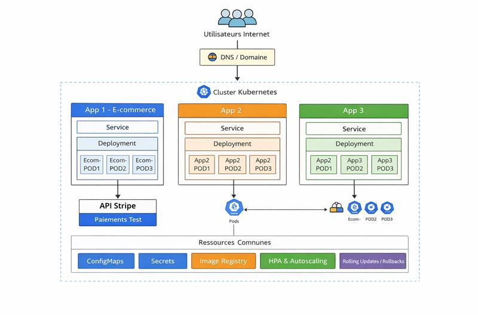

```
Cluster Minikube — laia-25-03-2026

PARTIE 1
├── Namespace: ecommerce-laia-25-03-2026
│   ├── Service: ecommerce-svc (LoadBalancer:5085)
│   ├── ConfigMap: ecommerce-configmap
│   ├── Secret: ecommerce-secret (clés Stripe)
│   └── Deployment: ecommerce (3 replicas)
│
├── Namespace: caddy-laia-25-03-2026
│   ├── ConfigMap: caddy-config (Caddyfile)
│   ├── Service: caddy-svc (LoadBalancer:80)
│   └── Deployment: caddy (3 replicas)
│       └── reverse_proxy vers ecommerce:5085
│
└── Namespace: excalidraw-laia-25-03-2026
    ├── Service: excalidraw-svc (LoadBalancer:80)
    └── Deployment: excalidraw (3 replicas)

PARTIE 2
├── Namespace: dev-laia-25-03-2026
│   ├── Service: NodePort:30085
│   ├── ConfigMap: DEBUG=True
│   └── Deployment: 1 replica
│
├── Namespace: preprod-laia-25-03-2026
│   ├── Service: ClusterIP
│   ├── ConfigMap: DEBUG=False, DEMO=True
│   ├── Deployment: 3 replicas
│   └── HPA: min:3 max:20 cpu:50%
│
└── Namespace: prod-laia-25-03-2026
    ├── Service: LoadBalancer
    ├── ConfigMap: DEBUG=False, DEMO=False
    ├── Deployment: 3 replicas
    └── HPA: min:3 max:20 cpu:50%
```

---

## 4. Démarche complète

### Prérequis
```bash
minikube start --cpus=4 --memory=6144 --driver=docker
minikube addons enable metrics-server
```

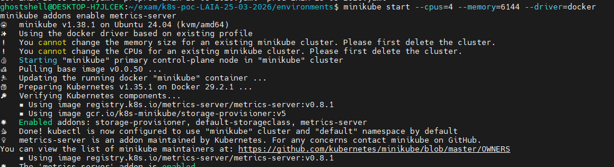

### Build image Docker
```bash
eval $(minikube docker-env)
cd ~/exam/priv-rocket-ecommerce-main
docker build -t rocket-ecommerce-lia-25-03-2026:local .
docker tag rocket-ecommerce-lia-25-03-2026:local \
  tomcruise57/rocket-ecommerce-lia-25-03-2026:latest
```


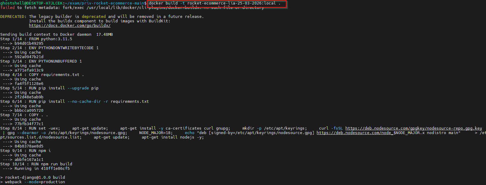

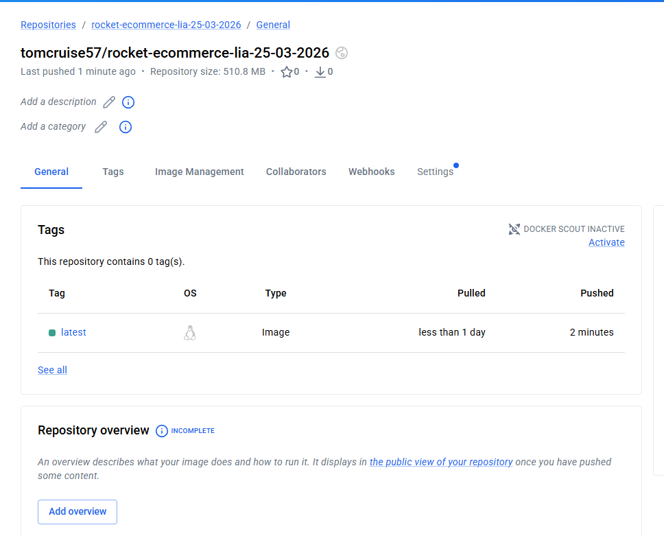

### Déploiement Partie 1
```bash
cd k8s-poc-LAIA-25-03-2026/deployments
kubectl apply -f ecommerce-LAIA-25-03-2026.yaml
kubectl apply -f caddy-LAIA-25-03-2026.yaml
kubectl apply -f excalidraw-laia-25-03-2026.yaml
```

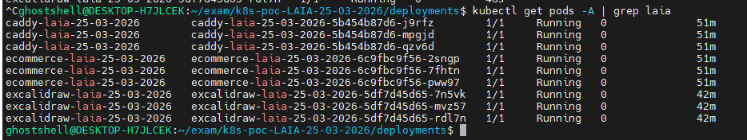

### Déploiement Partie 2
```bash
cd ../environments
kubectl apply -f dev-LAIA-25-03-2026.yaml
kubectl apply -f preprod-LAIA-25-03-2026.yaml
kubectl apply -f prod-LAIA-25-03-2026.yaml
```

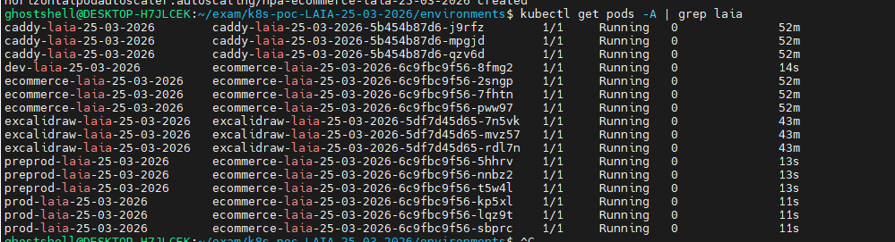

### Rollout / Rollback
```bash
# Annoter v1
kubectl annotate deployments.apps ecommerce-laia-25-03-2026 \
  -n prod-laia-25-03-2026 \
  kubernetes.io/change-cause="v1 - image rocket-ecommerce:latest" --overwrite

# Passer en v2
kubectl set image deployment/ecommerce-laia-25-03-2026 \
  ecommerce-laia-25-03-2026=tomcruise57/rocket-ecommerce-lia-25-03-2026:v2 \
  -n prod-laia-25-03-2026
kubectl annotate deployments.apps ecommerce-laia-25-03-2026 \
  -n prod-laia-25-03-2026 \
  kubernetes.io/change-cause="v2 - image rocket-ecommerce:v2" --overwrite

# Historique
kubectl rollout history deployment ecommerce-laia-25-03-2026 \
  -n prod-laia-25-03-2026

# Rollback
kubectl rollout undo deployment ecommerce-laia-25-03-2026 \
  -n prod-laia-25-03-2026 --to-revision=1
```

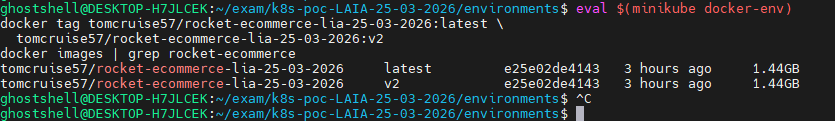

### Accès depuis Windows WSL2
```bash
kubectl port-forward svc/ecommerce-svc-laia-25-03-2026 5085:5085 \
  -n ecommerce-laia-25-03-2026 --address 0.0.0.0
# http://localhost:5085

kubectl port-forward svc/excalidraw-svc-laia-25-03-2026 8090:80 \
  -n excalidraw-laia-25-03-2026 --address 0.0.0.0
# http://localhost:8090
```

---

## 5. Avantages et inconvénients

### Minikube
| Avantages | Inconvénients |
|---|---|
| Gratuit, simple | Single-node |
| Supporte tous les objets K8s | Ressources limitées |
| Idéal pour POC | Pas de LoadBalancer natif |

### Caddy
| Avantages | Inconvénients |
|---|---|
| Image ultra légère alpine | Moins connu que Nginx |
| Configuration simple Caddyfile | Moins de plugins |

### Excalidraw
| Avantages | Inconvénients |
|---|---|
| Image légère | Application de dessin uniquement |
| Open source | Pas de backend persistant |

### Rocket Ecommerce
| Avantages | Inconvénients |
|---|---|
| Stripe intégré nativement | Image lourde 1.4GB |
| Dashboard admin complet | Nécessite beaucoup de RAM |

---

## 6. Preuves — Screenshots

### Screenshot 0 — Test paiement Stripe

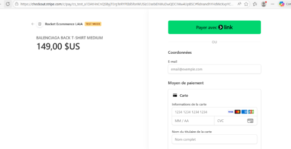

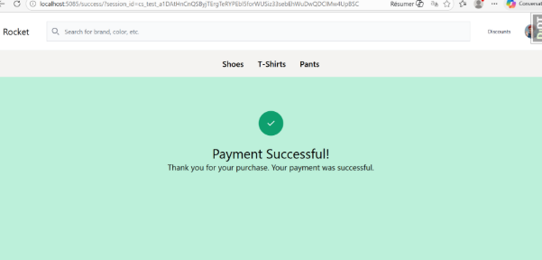

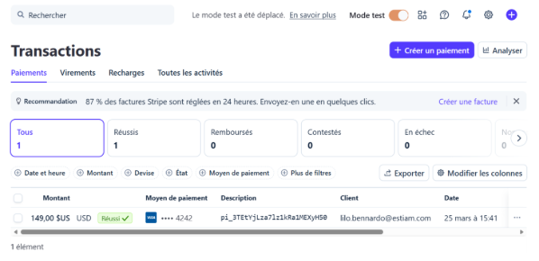

### Screenshot 1 — Pods Running : kubectl get pods -A


### Screenshot 2 — HPA actif : kubectl get hpa -A

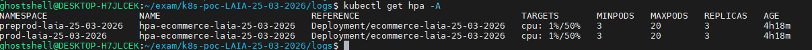

### Screenshot 3 — Rollout history REVISION 2 et 3

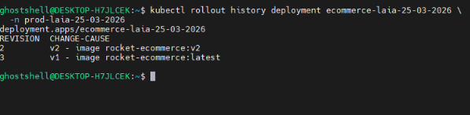

### Screenshot 4 — App Ecommerce localhost:5085

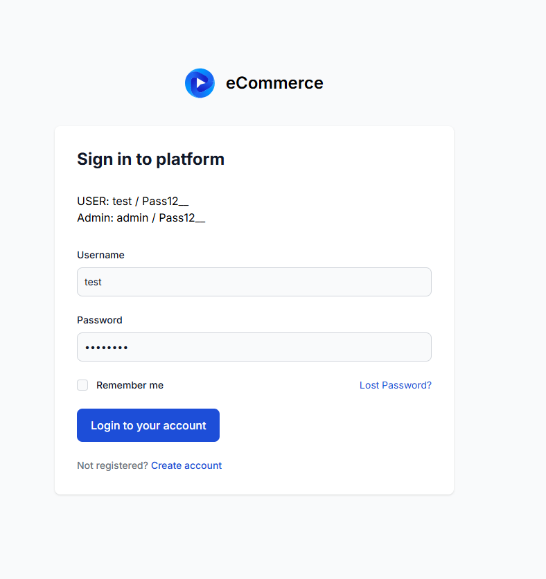

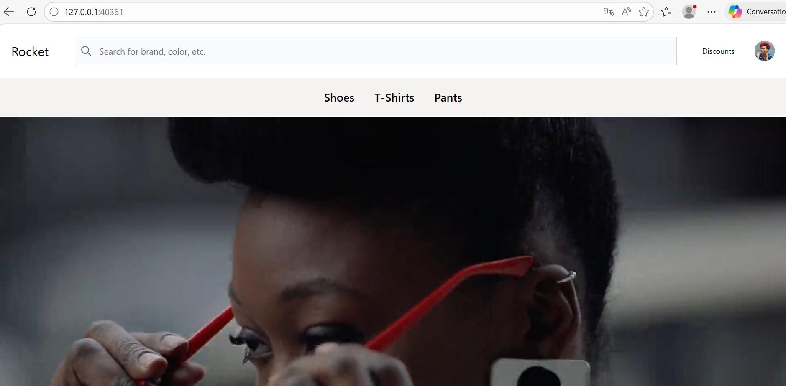

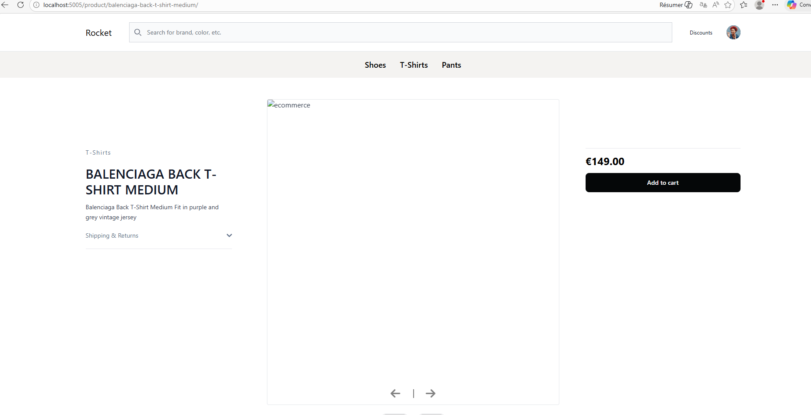

### Screenshot 5 — Excalidraw localhost:8090

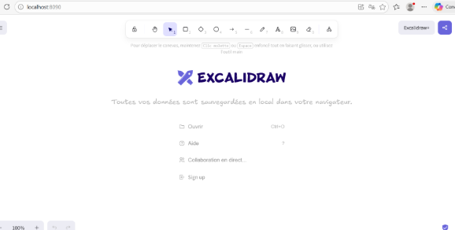

### Screenshot 6 — Netdata dashboard

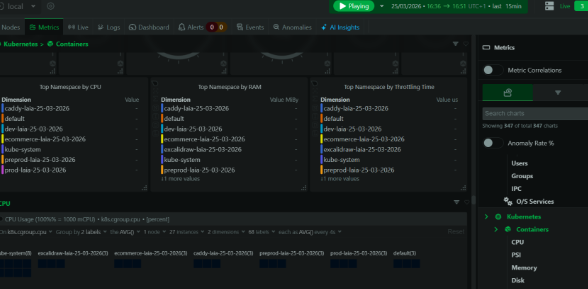

---

## 7. Fichiers de logs

Disponibles dans le repo Git : https://github.com/LiloBennardo/k8s5SDWANA.git

```
logs/
├── history-projet-laia-25-03-2026.log
├── history-kubernetes-events-projet-laia-25-03-2026.log
├── logs-ecommerce-laia-25-03-2026.log
├── logs-caddy-laia-25-03-2026.log
├── logs-excalidraw-laia-25-03-2026.log
├── logs-docker-ecommerce-laia-25-03-2026.log
├── logs-docker-caddy-laia-25-03-2026.log
└── logs-docker-excalidraw-laia-25-03-2026.log
```

### Commandes utilisées
```bash
# Historique Linux
history > logs/history-projet-laia-25-03-2026.log

# Kubernetes events
kubectl events -A > logs/history-kubernetes-events-projet-laia-25-03-2026.log

# Logs Kubernetes
kubectl logs -n ecommerce-laia-25-03-2026 -l app=ecommerce-laia-25-03-2026 \
  > logs/logs-ecommerce-laia-25-03-2026.log
kubectl logs -n caddy-laia-25-03-2026 -l app=caddy-laia-25-03-2026 \
  > logs/logs-caddy-laia-25-03-2026.log
kubectl logs -n excalidraw-laia-25-03-2026 -l app=excalidraw-laia-25-03-2026 \
  > logs/logs-excalidraw-laia-25-03-2026.log

# Logs Docker
eval $(minikube docker-env)
docker logs $(docker ps | grep ecommerce-laia | awk '{print $1}' | head -1) \
  > logs/logs-docker-ecommerce-laia-25-03-2026.log 2>&1
docker logs $(docker ps | grep caddy-laia | awk '{print $1}' | head -1) \
  > logs/logs-docker-caddy-laia-25-03-2026.log 2>&1
docker logs $(docker ps | grep excalidraw-laia | awk '{print $1}' | head -1) \
  > logs/logs-docker-excalidraw-laia-25-03-2026.log 2>&1
```

---

## 8. Commits Git

```
init: structure projet k8s-poc-LAIA-25-03-2026
feat: deploiement partie 1 ecommerce caddy excalidraw
feat: deploiement partie 2 dev preprod prod hpa
feat: rollout v1 v2 rollback prod
feat: netdata observabilite
docs: rapport logs laia-25-03-2026
```
